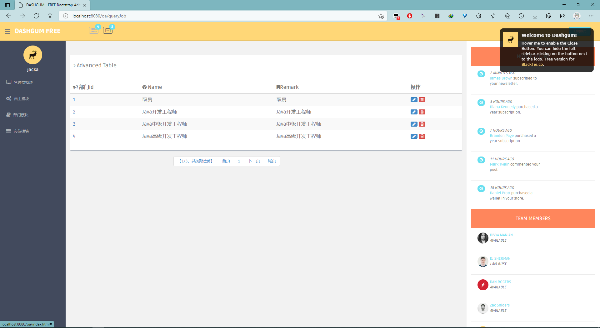

# 简介
一个只有对简单数据进行CURD的oa_system

### 使用技术
- IOC容器：Spring
- Web框架：SpringMVC
- ORM框架：Mybatis
- 数据源：druid

### 运行环境和所需工具       
- 开发工具：IntelliJ IDEA
- 项目构建工具：Maven
- 数据库：Mysql
- JDK版本：jdk1.8
- Tomcat版本：Tomcat8.x

### 初始化项目

- 在你的Mysql中，创建一个数据库名称为 oadb 的数据库，并导入我提供的 sql/oadb.sql 文件。
- 进入src/main/resources修改jdbc.properties配置文件,更改数据库driver,url,username和password，改为你自己的。data.properties就一个值，那是分页查询中每页的数量，可自行更改。
- 使用 IntelliJ IDEA 导入项目，选择Maven项目选项，一路点击next就行，导入项目后，如果src目录等，都没显示出来，别急先使用Maven构建该项目。
- 在 IntelliJ IDEA 中，配置我们的 Tomcat， 然后把使用Maven构建好的项目添加到Tomcat中。
- 运行。

### 功能模块

四个模块的CRUD操作中，还缺员工模块所有操作，部门和岗位模块的查找操作。

### 吐槽
总觉得没必要将dao，service分开user、dept、job写成多个文件
